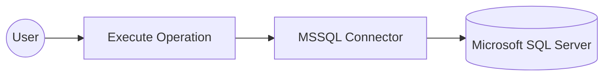
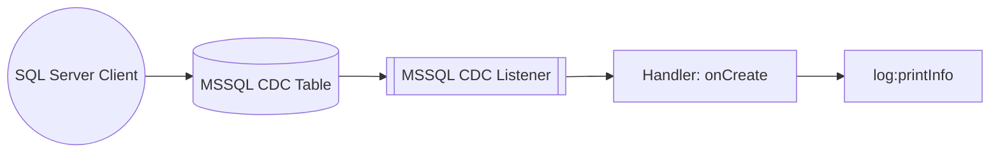

# Example

This page contains two end-to-end examples that use the MSSQL connector in WSO2 Integrator:

- [MSSQL connector example](#mssql-connector-example): Build an automation that inserts a record into an MSSQL table.
- [MSSQL CDC trigger example](#mssql-cdc-trigger-example): Build a service that reacts to row-insert events on an MSSQL table in real time.

---

## MSSQL connector example

Build a WSO2 Integrator automation that connects to a Microsoft SQL Server database using configurable connection parameters and executes an INSERT SQL statement. The integration uses the MSSQL connector to insert a record into a database table safely, without hardcoding credentials in source code.

**Operations used:**

- **Execute**: Runs a parameterized SQL INSERT statement against the connected MSSQL database and returns an execution result.

### Architecture

:::info Prerequisites
- A running Microsoft SQL Server instance with a table to insert records into.
- MSSQL database credentials (host, username, password, database name, and port).
:::

### Set up the MSSQL integration

:::tip New to WSO2 Integrator?
Follow the [Create a new integration](../../../../develop/create-integrations/create-a-new-integration.md) guide to set up your integration first, then return here to add the connector.
:::

### Add the MSSQL connector

#### Open the connector palette and select the MSSQL connector

1. From the integration canvas, select **+ Add Artifact** (or the connection **+** icon).
2. In the artifact picker, scroll to **Other Artifacts** and select **Connection**.
3. In the connector search palette, type `mssql`.
4. Select the **MS SQL** card to open the **Configure MS SQL** form.

### Configure the MSSQL connection

#### Bind connection parameters to configurable variables

The **Configure MS SQL** form opens. All connection parameters are under **Advanced Configurations**; select **Expand** if collapsed. For each parameter listed below:

1. Open the helper panel beside the field and go to the **Configurables** tab.
2. Select an existing configurable, or select **+ New Configurable**.
3. Supply a camelCase name and the appropriate type, then select **Save**. The configurable is injected into the field.

- **host**: MSSQL server hostname, bound to a `string` configurable named `mssqlHost`.
- **user**: Database username, bound to a `string?` configurable named `mssqlUser`.
- **password**: Database user password, bound to a `string?` configurable named `mssqlPassword`.
- **database**: Database name to connect to, bound to a `string?` configurable named `mssqlDatabase`.
- **port**: MSSQL server port, bound to an `int` configurable named `mssqlPort`.

After creating all five configurables, set **Connection Name** to `mssqlClient`.

#### Save the MSSQL connection

Select **Save Connection** to save the connector. The canvas returns to the main integration view and displays the `mssqlClient` connection node. The left-hand sidebar lists it under **Connections > mssqlClient**.

#### Set actual values for your configurables

1. In the left panel, select **Configurations**.
2. Set a value for each configurable listed below.

- **mssqlHost** (`string`): Hostname or IP address of your MSSQL server.
- **mssqlUser** (`string?`): Database username.
- **mssqlPassword** (`string?`): Database user password.
- **mssqlDatabase** (`string?`): Name of the target database.
- **mssqlPort** (`int`): TCP port for the MSSQL server.

### Configure the MSSQL execute operation

#### Add an automation entry point

1. Select **+ Add Artifact** on the canvas.
2. In the Artifacts panel, select **Automation** under the **Automation** section.
3. In the **Create New Automation** form, leave the defaults and select **Create**.

The automation flow editor opens, showing a **Start** node and an **Error Handler** node with an empty step slot between them.

#### Select and configure the execute operation

1. In the automation flow, select the **+** button between **Start** and **Error Handler**.
2. In the node panel, under **Connections**, select **mssqlClient** to expand its available operations.

3. Select **Execute** to add it to the flow and configure the following parameters:

- **sqlQuery**: The SQL INSERT statement to run against the database.
- **result**: The variable that stores the execution result (auto-generated as `sqlExecutionresult`).

4. Select **Save**.

### Try it yourself

Try this sample in WSO2 Integration Platform.

[View source on GitHub](https://github.com/wso2/integration-samples/tree/main/integrator-default-profile/connectors/mssql_connector_sample)

---

## MSSQL CDC trigger example

Build a WSO2 Integrator integration that listens for row-level change events on a Microsoft SQL Server table using the CDC trigger from the `ballerinax/mssql` package. When a new row is inserted into the configured CDC-enabled table, the trigger fires the `onCreate` handler, which receives the inserted row as a generic record payload. You define a custom `MssqlInsertRecord` type schema to structure the payload, then print its JSON representation to the integration log using `log:printInfo`.

### Architecture

:::info Prerequisites
- A running Microsoft SQL Server instance with Change Data Capture (CDC) enabled on the target database.
- A database user with sufficient privileges to read CDC change tables.
- The target table must have CDC enabled (via `sys.sp_cdc_enable_table`).
- Network connectivity from the WSO2 Integrator runtime to the SQL Server instance on the configured port.
:::

### Set up the MSSQL CDC integration

:::tip New to WSO2 Integrator?
Follow the [Create a new integration](../../../../develop/create-integrations/create-a-new-integration.md) guide to set up your integration first, then return here to add the trigger.
:::

### Add the CDC for Microsoft SQL Server trigger

#### Open the artifacts palette and select the CDC trigger

1. On the integration canvas, select **+ Add Artifact** to open the Artifacts palette.
2. In the **Event Integration** category, locate and select the **CDC for Microsoft SQL Server** card.

### Configure the CDC listener

#### Bind CDC listener parameters to configurable variables

For each connection parameter in the trigger configuration form, open the **Helper Panel**, select the **Configurables** tab, select **+ New Configurable**, enter the variable name and type, and select **Save**. The value is automatically injected into the field. Repeat for every non-enum, non-boolean parameter.

- **Host**: Hostname of the Microsoft SQL Server, bound to a `string` configurable.
- **Port**: TCP port the SQL Server listens on, bound to an `int` configurable.
- **Username**: SQL Server login username with CDC read access, bound to a `string` configurable.
- **Password**: SQL Server login password, bound to a `string` configurable.
- **Databases**: The database to capture changes from (add one entry and bind it), bound to a `string` configurable.
- **Table**: Fully-qualified table name to capture events from (format `<database>.<schema>.<table>`), bound to a `string` configurable.

#### Set actual values for your configurations

In the left panel of WSO2 Integrator, select **Configurations** (at the bottom of the project tree, under Data Mappers) to open the Configurations panel. Set a value for each configuration:

- **mssqlHost** (`string`): Hostname or IP address of your SQL Server instance.
- **mssqlPort** (`int`): Port SQL Server listens on.
- **mssqlUsername** (`string`): SQL Server username with permission to read CDC change tables.
- **mssqlPassword** (`string`): Password for the SQL Server user.
- **mssqlDatabase** (`string`): Name of the CDC-enabled database (for example, `SalesDB`).
- **mssqlTableName** (`string`): Fully-qualified table to watch for changes (for example, `SalesDB.dbo.Orders`).

#### Create the trigger

Select **Create** at the bottom of the trigger configuration form. WSO2 Integrator creates the CDC listener and opens the Service view showing the listener chip.

### Handle CDC events

#### Open the Add Handler side panel

1. In the Service view, locate the **Event Handlers** section and select **+ Add Handler**.
2. The **Select Handler to Add** side panel opens, listing the available CDC handler options: `onRead`, `onCreate`, `onUpdate`, `onDelete`, and `onError`.

#### Select the onCreate handler and define the message payload type

1. In the side panel, select **onCreate** to open the **Message Handler Configuration** panel.
2. In the **Message Configuration** field, select **Define Value** to open the type definition modal.
3. Select the **Create Type Schema** tab and enter `MssqlInsertRecord` in the **Name** field.
4. Select the **+** icon next to **Fields** to add each payload field, entering a field name and a Ballerina type for every field, for example, `id` (`int`) and `tableName` (`string`).
5. Select **Save** to create the record type and bind it to the handler.

#### Save the handler and add a log statement to the flow

1. Select **Save** on the **Message Handler Configuration** panel. The flow canvas for the `onCreate` handler opens.
2. In the handler flow canvas, add a **log:printInfo** step with `after.toJsonString()` as the message.
3. Verify the `log:printInfo` node appears between **Start** and **Error Handler** on the canvas.

#### Confirm the handler is registered in the Service view

Select the back arrow in the canvas header to return to the Service view. The Event Handlers list now shows the registered **Event onCreate** handler row.

### Run the integration

Select **Run** in WSO2 Integrator to start the integration. The CDC listener connects to your SQL Server instance and begins polling the CDC change tables for the configured database and table.

To fire a test event, use one of the following approaches:

- **WSO2 Integrator MSSQL producer**: Run a separate WSO2 Integrator integration that uses the MSSQL connector to insert a row into the monitored table. Recommended because it stays within the WSO2 Integrator environment.
- **Native SQL client**: Use **sqlcmd**, **Azure Data Studio**, or **SQL Server Management Studio** to execute an `INSERT INTO <tableName> (<columns>) VALUES (<values>);` statement against the CDC-enabled table.
- **Azure Portal Query Editor**: Use the **Azure Portal Query Editor** or any SQL web client connected to your SQL Server instance, if the server is hosted in Azure SQL Database.

When an insert is detected, the `onCreate` handler fires and the inserted row appears as a JSON string in the integration log, confirming end-to-end event capture.

### Try it yourself

Try this sample in WSO2 Integration Platform.

[View source on GitHub](https://github.com/wso2/integration-samples/tree/main/integrator-default-profile/connectors/mssql_trigger_sample)

## What's next

- [Action Reference](actions.md) — All operations, parameters, and sample code.
- [Trigger Reference](triggers.md) — Listener configuration and CDC callbacks.
- [Setup Guide](setup-guide.md) — Provision SQL Server and enable CDC.
