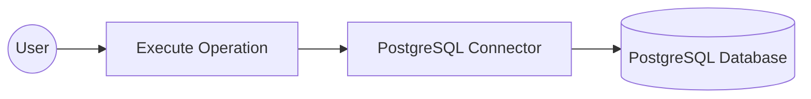
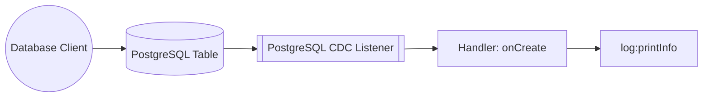

# Example

This page contains two end-to-end examples that use the PostgreSQL connector in WSO2 Integrator:

- [PostgreSQL connector example](#postgresql-connector-example): Build an automation that inserts a record into a PostgreSQL table.
- [PostgreSQL CDC trigger example](#postgresql-cdc-trigger-example): Build a service that reacts to row-insert events on a PostgreSQL table in real time.

---

## PostgreSQL connector example

Build a WSO2 Integrator automation that connects to a PostgreSQL database using configurable connection parameters and executes an INSERT SQL statement. The integration uses the PostgreSQL connector to insert a record into a database table safely, without hardcoding credentials in source code.

**Operations used:**

- **Execute**: Runs a parameterized SQL INSERT statement against the connected PostgreSQL database and returns an execution result.

### Architecture

:::info Prerequisites
- A running PostgreSQL database instance with a table to insert records into.
- PostgreSQL database credentials (host, username, password, database name, and port).
:::

### Set up the PostgreSQL integration

:::tip New to WSO2 Integrator?
Follow the [Create a new integration](../../../../develop/create-integrations/create-a-new-integration.md) guide to set up your integration first, then return here to add the connector.
:::

### Add the PostgreSQL connector

#### Open the connector palette and select the PostgreSQL connector

1. On the canvas, select **+ Add Connection** to open the connector palette.
2. In the palette search box, enter **PostgreSQL**.
3. Select the **PostgreSQL** card to open the **Configure PostgreSQL** form.

### Configure the PostgreSQL connection

#### Fill in the PostgreSQL connection parameters

In the **Configure PostgreSQL** form, expand **Advanced Configurations** to reveal all connection fields. Use the **Configurables** tab in the helper panel to bind each field to a configurable variable, keeping credentials out of source code. For each parameter listed below:

1. Open the helper panel beside the field and go to the **Configurables** tab.
2. Select an existing configurable, or select **+ New Configurable**.
3. Supply a camelCase name and the appropriate type, then select **Save**. The configurable is injected into the field.

- **host**: PostgreSQL server hostname, bound to a `string` configurable named `postgresHost`.
- **username**: Database username, bound to a `string?` configurable named `postgresUser`.
- **password**: Database user password, bound to a `string?` configurable named `postgresPassword`.
- **database**: Database name to connect to, bound to a `string?` configurable named `postgresDatabase`.
- **port**: PostgreSQL server port, bound to an `int` configurable named `postgresPort`.

After creating all five configurables, set **Connection Name** to `postgresqlClient`.

#### Save the PostgreSQL connection

Select **Save Connection** to save the connector. The canvas returns to the integration overview, and `postgresqlClient` is now visible under **Connections** in the left project tree.

#### Set actual values for your configurables

1. In the left panel, select **Configurations**.
2. Set a value for each configurable listed below.

- **postgresHost**: Hostname or IP address of your PostgreSQL server (`string`).
- **postgresUser**: Database username (`string?`).
- **postgresPassword**: Database user password (`string?`).
- **postgresDatabase**: Name of the database to connect to (`string?`).
- **postgresPort**: Port number your PostgreSQL server listens on (`int`).

### Configure the PostgreSQL execute operation

#### Add an automation entry point

1. Select **+ Add Artifact** on the canvas toolbar.
2. Under **Automation**, select the **Automation** tile.
3. Select **Create**. No additional configuration is needed.

The automation flow canvas opens, showing a **Start** node and an **Error Handler** node with an empty step slot between them.

Select the empty step placeholder in the flow to open the step addition panel. In the right panel, locate the **Connections** section, select **postgresqlClient** to expand its available operations, and then select **Execute**.

#### Configure the execute operation parameters and save

Fill in the operation fields, then select **Save** to add the step to the automation flow.

- **sqlQuery**: A parameterized SQL INSERT statement to execute. Use backtick-templated parameters so values are bound safely (no string concatenation). For example: `` `INSERT INTO Customers (firstName, lastName, country) VALUES (${firstName}, ${lastName}, ${country})` ``, where `firstName`, `lastName`, and `country` are Ballerina variables.
- **result**: Variable that holds the returned `sql:ExecutionResult`. Pre-filled as `sqlExecutionresult`.

The automation flow now contains a single execute step between **Start** and **Error Handler**.

### Try it yourself

Try this sample in WSO2 Integration Platform.

[View source on GitHub](https://github.com/wso2/integration-samples/tree/main/integrator-default-profile/connectors/postgresql_connector_sample)

---

## PostgreSQL CDC trigger example

This integration uses the PostgreSQL CDC trigger to listen for row-level insert events on a PostgreSQL table in real time. When a new row is inserted, the `onCreate` handler receives a typed `PostgreSQLInsertEntry` record containing the new row's data and logs it to the console. The overall flow runs from listener to handler to `log:printInfo`, giving you a foundation for event-driven pipelines such as data sync, audit logging, or downstream notifications.

### Architecture

:::info Prerequisites
- A running PostgreSQL instance with logical replication enabled (`wal_level = logical`).
- A PostgreSQL user with the `REPLICATION` privilege on the target database.
- The target table already created in the database.
:::

### Set up the PostgreSQL CDC integration

:::tip New to WSO2 Integrator?
Follow the [Create a new integration](../../../../develop/create-integrations/create-a-new-integration.md) guide to set up your integration first, then return here to add the trigger.
:::

### Add the PostgreSQL CDC trigger

#### Open the artifacts palette

Select **+ Add Artifact** in the WSO2 Integrator side panel to open the Artifacts palette. Locate the **Event Integration** category and select the **CDC for PostgreSQL** trigger card.

### Configure the PostgreSQL CDC listener

#### Bind listener parameters to configurable variables

Fill in the trigger configuration form, binding every connection field to a `configurable` variable so that credentials are never hardcoded:

- **Hostname**: Hostname or IP address of the PostgreSQL server.
- **Port**: Port on which PostgreSQL is listening.
- **Username**: PostgreSQL user with replication privileges.
- **Password**: Password for the PostgreSQL user.
- **Database Name**: Name of the database that contains the monitored table.
- **Table Name**: Fully-qualified table name to watch for CDC events.

#### Set actual values for your configurations

Select **Configurations** in the left panel of WSO2 Integrator to verify that all six configurable variables were registered. Enter a value for each configuration:

- **postgresHost** (`string`): Hostname or IP address of the PostgreSQL server.
- **postgresPort** (`int`): Port on which PostgreSQL is listening (default `5432`).
- **postgresUser** (`string`): PostgreSQL user with replication privileges.
- **postgresPassword** (`string`): Password for the PostgreSQL user.
- **postgresDatabase** (`string`): Name of the database that contains the monitored table.
- **postgresTable** (`string`): Fully-qualified table name to watch for CDC events (for example, `public.orders`).

#### Create the trigger

Select **Create** to submit the trigger configuration and generate the listener.

### Handle PostgreSQL CDC events

#### Add the onCreate handler

In the Service view, select **+ Add Handler** to open the handler selection panel. Select **onCreate** to handle row-insert CDC events.

#### Define the entry type schema

Select the **onCreate** handler, then open **Message Configuration** > **Define Value** on the `afterEntry` parameter. On the **Create Type Schema** tab, enter `PostgreSQLInsertEntry` as the **Name**. Select the **+** icon next to **Fields** to add each field: for example, `id` of type `string` and `name` of type `string`. The fields should mirror the columns in your target table. Select **Save** when done.

#### Add a log step to the handler body

After saving, the `onCreate` handler body is generated with an **Error Handler** node. Select the **+** icon in the flow chart and choose **Log Info** from the **Logging** section in the side panel. Enter `afterEntry.toJsonString()` as the message to log every received CDC entry as JSON.

#### Confirm the registered handler

Navigate back to the **CDC for PostgreSQL** Service view. The **Event Handlers** section now lists the `onCreate` handler row, confirming the integration is fully wired and ready to receive insert events from the configured PostgreSQL table.

### Run the integration

Select **Run** in WSO2 Integrator to start the integration. The PostgreSQL CDC listener connects to your database and begins monitoring the configured table for insert events.

To fire a test event, use one of the following approaches:

- **WSO2 Integrator database client**: If your project includes a database connection, use the built-in query runner to execute an `INSERT` statement against the monitored table directly from the IDE.
- **psql CLI**: Connect to your PostgreSQL instance with `psql` and run an `INSERT` statement against the target table (for example, `INSERT INTO public.orders (id, name) VALUES (1, 'test')`).
- **PostgreSQL web console**: Use pgAdmin or another GUI client to insert a row into the monitored table through the table data editor.

When an insert is detected, the `onCreate` handler fires and the serialized `PostgreSQLInsertEntry` record appears in the WSO2 Integrator console log, confirming end-to-end event capture.

### Try it yourself

Try this sample in WSO2 Integration Platform.

[View source on GitHub](https://github.com/wso2/integration-samples/tree/main/integrator-default-profile/connectors/postgresql_trigger_sample)
